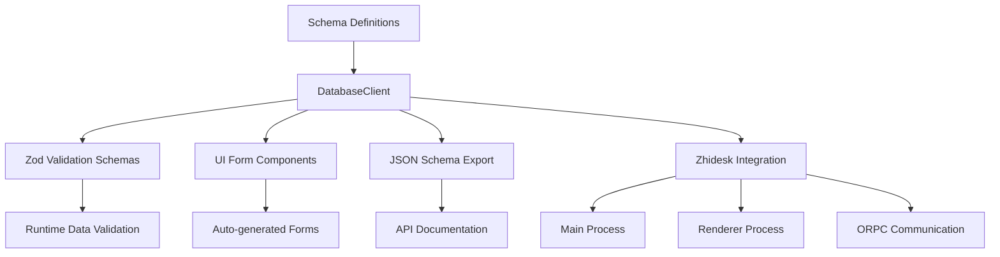

# SchemaFlow: Dynamic Schema Management & Validation Engine untuk Zhidesk


## 🚀 Overview

SchemaFlow adalah sistem manajemen schema berbasis TypeScript yang terintegrasi dengan platform low-code desktop **Zhidesk**. Sistem ini secara otomatis menghasilkan validasi runtime, endpoint API, dan komponen UI dari definisi schema database deklaratif. Dibangun dengan Zod untuk type safety dan validasi yang robust.

## ✨ Features

### 🎯 Core Capabilities

- **Dynamic Schema Definition**: Define database schemas melalui code atau UI
- **Automatic Validation Generation**: Validasi runtime powered oleh Zod
- **Type-Safe Operations**: Dukungan TypeScript lengkap dengan auto-completion
- **Multi-Database Support**: Kelola multiple databases dan tables
- **JSON Schema Export**: Generate OpenAPI-compatible schemas

### 📦 Integration dengan Zhidesk

- **Low-Code Desktop Platform**: Terintegrasi sempurna dengan Zhidesk
- **ORPC Communication**: Komunikasi type-safe antar proses Electron
- **LowDB Storage**: Penyimpanan distributed dengan satu file per collection
- **Auto-generated Forms**: Form UI otomatis berdasarkan schema

## 🏗️ Architecture



## 📋 Supported Data Types

| Type            | Validation                        | UI Components        |
| --------------- | --------------------------------- | -------------------- |
| **String**      | Email, URL, UUID, Pattern, Length | Input, Textarea      |
| **Number**      | Min/Max, Integer, Positive        | Number input, Slider |
| **Boolean**     | Literal values                    | Switch, Checkbox     |
| **Date**        | Past/Future, Ranges               | Datepicker, Datetime |
| **Enum**        | Predefined options                | Select, Radio        |
| **Reference**   | Foreign keys                      | Relationship select  |
| **Array**       | Min/Max length                    | Repeater fields      |
| **Object**      | Nested structures                 | Field groups         |

## 🚀 Quick Start

### Installation (Dalam Zhidesk)

```bash
# Sudah terintegrasi dalam Zhidesk - tidak perlu install terpisah
npm run dev  # Menjalankan Zhidesk dengan SchemaFlow
```

### Basic Usage dalam Zhidesk

```typescript
import { DatabaseClient } from '@schema/database/client'
import type { SchemaDatabase } from '@schema/database'

// Define database schema (biasanya dari ORPC/service)
const databases: SchemaDatabase[] = [
  {
    ...getSchemaCore(),
    name: 'Users Database',
    description: 'Stores user information',
    version: 1,
    tables: [
      {
        ...getSchemaCore(),
        name: 'Users',
        description: 'User accounts table',
        columns: [
          {
            ...getSchemaCore(),
            name: 'name',
            type: 'string',
            description: 'User full name',
            isNullable: false,
            isOptional: false,
            validation: {
              min: 2,
              max: 100
            }
          },
          {
            ...getSchemaCore(),
            name: 'email',
            type: 'string',
            description: 'Email address',
            isNullable: false,
            validation: {
              format: 'email'
            }
          }
        ]
      }
    ]
  }
]

// Initialize client
const client = new DatabaseClient(databases)

// Generate validation schema
const userSchema = client.generateZodSchema({
  databaseId: databases[0]._id,
  tableId: databases[0].tables[0]._id
})

// Validasi data
const userData = {
  name: 'John Doe',
  email: 'john@example.com'
}

const result = userSchema.safeParse(userData)
if (result.success) {
  console.log('Valid data:', result.data)
} else {
  console.error('Validation errors:', result.error.format())
}
```

## 🎨 Use Cases dalam Zhidesk

### 1. Dynamic Form Generation

```typescript
// Di renderer process - gunakan custom hooks
import { useTableSchema } from '@renderer/hooks/useSchema'

function UserForm() {
  const { schema, defaultValues } = useTableSchema({
    databaseId: 'users-db',
    tableId: 'users'
  })

  const form = useForm({
    resolver: zodResolver(schema),
    defaultValues
  })

  return (
    <Form {...form}>
      <form onSubmit={form.handleSubmit(onSubmit)}>
        <DynamicFormFields schema={schema} />
      </form>
    </Form>
  )
}
```

### 2. API Validation Middleware

```typescript
// Di service layer - validasi input data
import { orpc } from '@service/orpc/router'

export const documentService = {
  create: async (data: unknown, props: { databaseId: string; tableId: string }) => {
    const client = new DatabaseClient(await getDatabases())
    const schema = client.generateZodSchema(props)

    const validatedData = schema.parse(data)

    // Simpan ke LowDB
    return await db.collection(props.tableId).insert(validatedData)
  }
}
```

### 3. Schema Management UI

```typescript
// Auto-generate schema editor UI
function SchemaEditor({ databaseId, tableId }) {
  const { data: table } = useTable({ databaseId, tableId })
  const { data: jsonSchema } = useQuery({
    queryKey: ['schema-json', databaseId, tableId],
    queryFn: () => orpc.schema.generateJSON.call({ databaseId, tableId })
  })

  return (
    <div>
      <h2>{table?.name} Schema</h2>
      <JsonViewer data={jsonSchema} />
    </div>
  )
}
```

## 🔧 Advanced Configuration

### Custom Validation Rules

```typescript
// Extend DatabaseClient untuk custom validasi
class ZhideskDatabaseClient extends DatabaseClient {
  generateZodString(column: SchemaColumnString): GenerateZodResult {
    const baseSchema = super.generateZodString(column)

    // Tambahkan validasi custom untuk Zhidesk
    if (column.validation?.zhideskFormat) {
      return baseSchema.regex(/^zhidesk-\d+$/)
    }

    return baseSchema
  }
}
```

### Internationalization Support

```typescript
// Custom error messages untuk multi-language
const i18nClient = new DatabaseClient(databases, {
  setMeta: (schema, column) => {
    return schema.meta({
      title: i18n.t(column.name),
      description: i18n.t(column.description),
      errorMap: (issue, ctx) => {
        return { message: i18n.t(`validation.${issue.code}`) }
      }
    })
  }
})
```

## 📊 API Reference

### DatabaseClient Methods

| Method                | Description | Returns |
| --------------------- | ----------- | ------- |
| `getTables(props)` | Dapatkan semua tables | `ObjectChain<SchemaStoreTables>` |
| `getTable(props)` | Dapatkan table specific | `ObjectChain<SchemaStoreTables[string]>` |
| `getTableColumns(props)` | Dapatkan columns table | `ObjectChain<SchemaStoreColumns>` |
| `generateZodSchema(props, options)` | Generate Zod schema | `ZodObject` |
| `generateZodJSON(props)` | Generate JSON Schema | `JSONSchema` |
| `getDefaultValues(props)` | Get default values | `Record<string, TypeOfGenerateZodType>` |

### Schema Types Import

```typescript
import type {
  SchemaDatabase,
  SchemaTable,
  SchemaTableColumn,
  SchemaColumnString,
  SchemaColumnNumber,
  SchemaColumnBoolean,
  SchemaColumnDate,
  SchemaColumnEnum,
  SchemaColumnReference,
  SchemaColumnArray,
  SchemaColumnObject
} from '@schema/database'
```

## 🛠️ Development dalam Zhidesk

### Project Structure

```
src/
├── schema/
│   └── database/
│       ├── client.ts          # DatabaseClient implementation
│       ├── index.ts          # Schema definitions and types
│       ├── client.test.ts    # Unit tests
│       └── index.test.ts     # Validation tests
```

### Testing

```bash
# Run schema tests
npm run test -- src/schema/database/

# Run dengan coverage
npm run test:coverage -- src/schema/database/

# Run tests specific
npm run test -- src/schema/database/client.test.ts
```

### Build Commands

```bash
npm run build          # Build production
npm run build:main    # Build main process only
npm run build:renderer # Build renderer only
npm run dev           # Development mode
```

## 📦 Integration Points

### Dengan Service Layer

```typescript
// src/service/database/schema.service.ts
export const schemaService = {
  generateValidationSchema: (props: { databaseId: string; tableId: string }) => {
    const databases = await loadDatabases()
    const client = new DatabaseClient(databases)
    return client.generateZodSchema(props)
  },

  generateJSONSchema: (props: { databaseId: string; tableId: string }) => {
    const databases = await loadDatabases()
    const client = new DatabaseClient(databases)
    return client.generateZodJSON(props)
  }
}
```

### Dengan ORPC Router

```typescript
// src/service/orpc/router.ts
export const orpcRouter = router({
  schema: {
    generate: procedure.input(z.object({
      databaseId: z.string(),
      tableId: z.string()
    })).query(async ({ input }) => {
      return schemaService.generateValidationSchema(input)
    }),

    generateJSON: procedure.input(z.object({
      databaseId: z.string(),
      tableId: z.string()
    })).query(async ({ input }) => {
      return schemaService.generateJSONSchema(input)
    })
  }
})
```

## 🔮 Roadmap

- [ ] **Visual Schema Editor**: Drag-and-drop schema builder
- [ ] **Real-time Collaboration**: Multi-user schema editing
- [ ] **Schema Versioning**: Migration and history tracking
- [ ] **Export Formats**: SQL, GraphQL, OpenAPI
- [ ] **Plugin System**: Custom validators and UI components
- [ ] **Performance Optimization**: Caching and lazy loading

## 🤝 Contributing

Kontribusi dipersilakan! Ikuti panduan berikut:

1. Fork repository Zhidesk
2. Buat feature branch: `git checkout -b feat/schema-enhancement`
3. Commit changes: `git commit -m 'Add schema validation feature'`
4. Push: `git push origin feat/schema-enhancement`
5. Buat Pull Request

## 📄 License

MIT License - lihat [LICENSE](LICENSE) untuk detail.

## 🆘 Support

- 📚 [Zhidesk Documentation](https://zhidesk.dev/docs)
- 🐛 [Issue Tracker](https://github.com/zhidesk/issues)
- 💬 [Community Discord](https://discord.gg/zhidesk)
- 📧 [Email Support](support@zhidesk.dev)

## 🙏 Acknowledgments

- [Zod](https://github.com/colinhacks/zod) untuk validation library yang excellent
- [Lodash](https://lodash.com/) untuk utility functions
- [Electron](https://electronjs.org/) untuk desktop framework
- [React](https://reactjs.org/) untuk UI library

---

**SchemaFlow** - Powering dynamic schemas and validation untuk **Zhidesk** Low-Code Platform. 🚀
